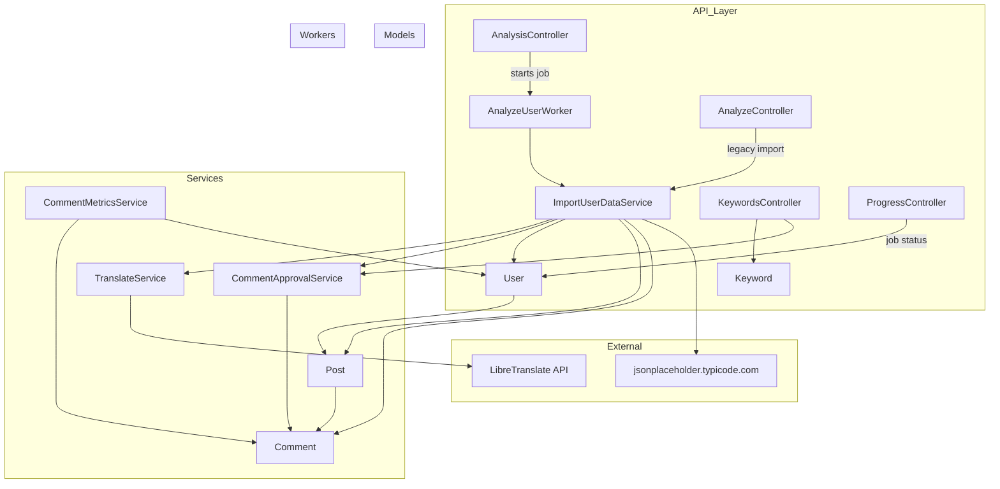
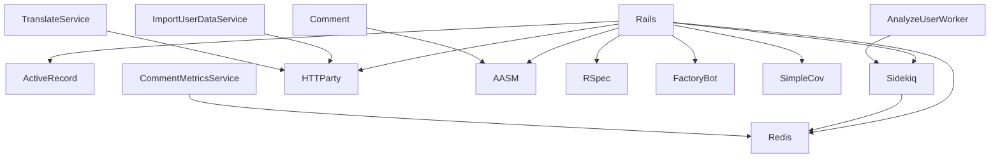
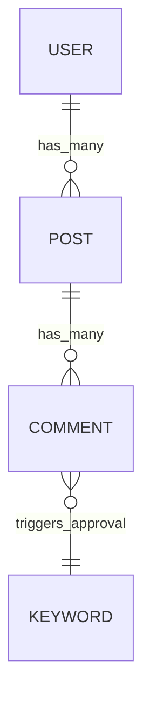
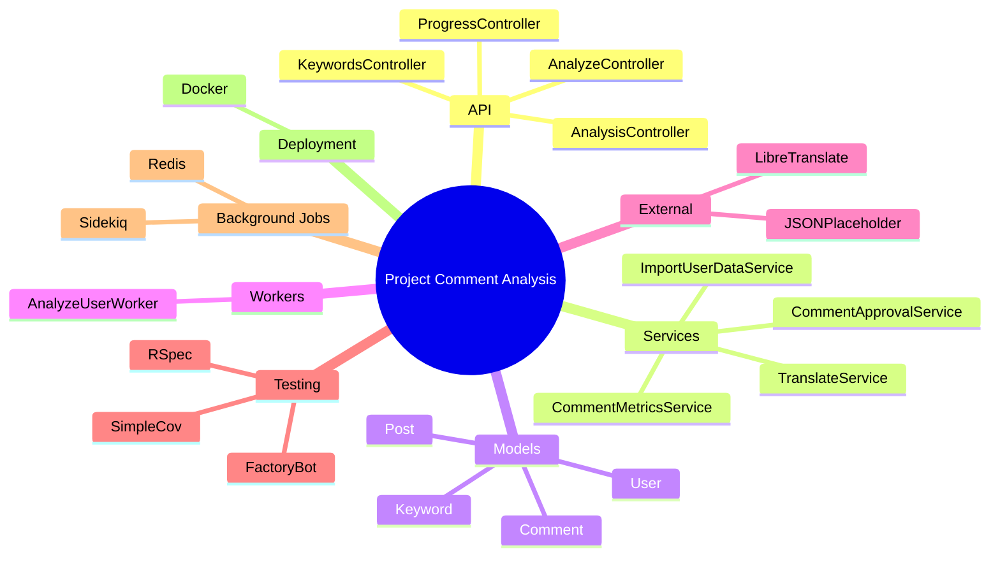
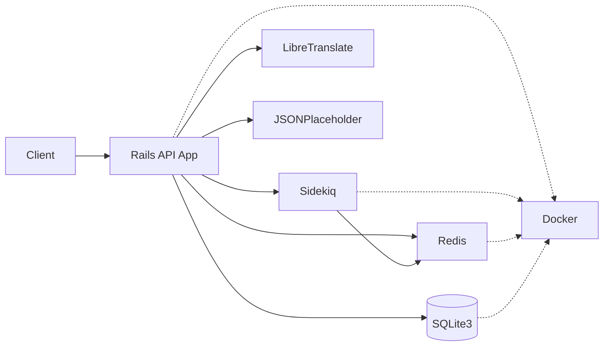
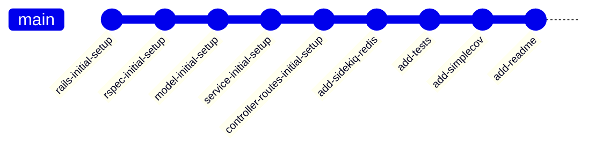

# **Rails Comment Analysis**

[Homepage](https://github.com/enogrob/rails_comment_analysis)


## Contents

- [Summary](#summary)
- [Architecture](#architecture)
  - [Decisions made](#decisions-made)
  - [Statistical formulas](#statistical-formulas)
  - [Example requests](#example-requests)
  - [Key Concepts](#key-concepts)
- [Tech Stack](#tech-stack)
- [References](#references)

---

## Summary

**Rails Comment Analysis** is a Ruby on Rails 8 API application designed to automate the import, translation, analysis, and approval of user-generated comments from external sources. The system fetches user, post, and comment data from a public API, translates comment bodies, and applies keyword-based approval logic. It is built for developers, data analysts, and teams seeking to automate comment moderation and gain insights into comment quality and trends.

**Key features:**
- Automated import of users, posts, and comments from external APIs
- Real-time translation of comment bodies using LibreTranslate
- Keyword-based comment approval and rejection
- **Statistical analysis** of comment lengths (mean, median, stddev)
- **RESTful and legacy API endpoints** for analysis, progress, and keyword management
- **Background processing** with Sidekiq and Redis for scalable analysis
- **Full test coverage** with RSpec and SimpleCov

**Relevance:**
The project demonstrates best practices in Rails API design (well-aligned with SOLID principles) background job processing, and test-driven development. Its modular, service-oriented structure and use of modern gems make it a strong reference for scalable, maintainable API projects.


## Architecture


### System Overview




#### Alternative Perspectives

<details>
<summary>Gems Dependency Diagram</summary>



</details>

<details>
<summary>Dependencies and Models</summary>



</details>

<details>
<summary>Mind Map - Interconnected Themes</summary>



</details>

<details>
<summary>Deployment Architecture</summary>



</details>

<details>
<summary>Git Graph</summary>



</details>

#### Decisions made

- **Layered architecture:** controllers, services, models, workers
- **Service objects** encapsulate business logic (import, metrics, approval, translation)
- **Sidekiq** for background jobs; Redis for caching and queueing
- **RESTful and legacy endpoints** for compatibility
- **Full test coverage** enforced

#### Statistical formulas

- **Mean:** sum of comment body lengths / number of comments
- **Median:** middle value of sorted comment body lengths
- **Standard deviation:** sqrt of average squared difference from mean

#### Example requests

<details>
<summary>Start analysis for a user</summary>

```bash
curl -X POST \
  http://localhost:3000/analysis \
  -H 'Content-Type: application/json' \
  -d '{"username": "Bret"}'
# Response: { "job_id": "...", "message": "Analysis started for Bret" }
```

</details>

<details>
<summary>Check job progress</summary>

```bash
curl http://localhost:3000/progress/<job_id>
# Replace <job_id> with the value returned from the previous request
# Response: { "job_id": "...", "progress": "100%" }
```

</details>

<details>
<summary>Add a keyword</summary>

```bash
curl -X POST \
  http://localhost:3000/keywords \
  -d 'keyword[word]=foo'
# Response: { "id": ..., "word": "foo", ... }
```

</details>

<details>
<summary>List all keywords</summary>

```bash
curl http://localhost:3000/keywords
# Response: [ { "id": ..., "word": "foo" }, ... ]
```

</details>

<details>
<summary>Update a keyword</summary>

```bash
curl -X PUT \
  http://localhost:3000/keywords/1 \
  -d 'keyword[word]=bar'
# Response: { "id": 1, "word": "bar", ... }
```

</details>

<details>
<summary>Delete a keyword</summary>

```bash
curl -X DELETE http://localhost:3000/keywords/1
# Response: (204 No Content)
```

</details>

#### Key Concepts

- **ImportUserDataService:** Imports user, post, and comment data from external API
- **TranslateService:** Translates comment bodies to Portuguese
- **CommentApprovalService:** Approves/rejects comments based on keyword matches
- **CommentMetricsService:** Calculates statistics for comment lengths
- **AnalyzeUserWorker:** Runs import and metrics in background


## Tech Stack

- Ruby 3.2.2
- Rails 8.0.2 (API mode)
- Sidekiq 8.0 (background jobs)
- Redis 5.4 (caching, queueing)
- HTTParty (HTTP requests)
- AASM (state machines)
- RSpec, FactoryBot, SimpleCov (testing)
- Docker (deployment)


## References

- [Project Homepage](https://github.com/enogrob/rails_comment_analysis)
- [Rails Guides](https://guides.rubyonrails.org/)
- [Sidekiq Documentation](https://sidekiq.org/)
- [LibreTranslate API](https://libretranslate.com/docs/)
- [jsonplaceholder.typicode.com](https://jsonplaceholder.typicode.com/)

